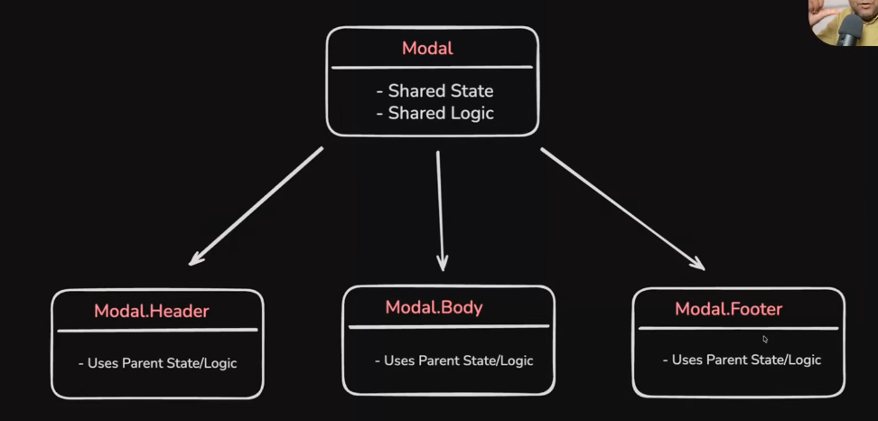

# Day 03 - Compound Components Pattern

## **🎯 Goal of This Lesson**

- About Day 03
- We Will Learn
- Prerequisites
- The Prop Soup
- The Problems
- The Compound Components Pattern
- Applying the Pattern to Messy Modal
- Implementing Accordion
- Use Cases
- PitFalls & Anti-Patterns
- Tasks & Wrap Up

## 🫶 Support

Your support means a lot.

- Please SUBSCRIBE to [tapaScript YouTube Channel](https://youtube.com/tapasadhikary) if not done already. A Big Thank You!
- Liked my work? It takes months of hard work to create quality content and present it to you. You can show your support to me with a STAR(⭐) to this repository.

  > Many Thanks to all the `Stargazers` who have supported this project with stars(⭐)

### 🤝 Sponsor My Work

I am an independent educator and open-source enthusiast who creates meaningful projects to teach programming on my YouTube Channel. **You can support my work by [Sponsoring me on GitHub](https://github.com/sponsors/atapas) or [Buy Me a Cofee](https://buymeacoffee.com/tapasadhikary)**.

## Video

Here is the video for you to go through and learn:

My Notes:

We will learn

- Bloated components with prop soup
- The compound component pattern
- Use Cases
- Pitfalls and Best Practices

- Components like Modal violates separation of concerns like layout and variation
- Testing Modal component would become difficult.
- Introducing every variation for a component makes code smell.

  

Use Cases

- Dropdown , Modal, Accordion, Table
- Any component where layout and nesting matter, compound pattern is a must.
- Material UI , shadcn ui all use these pattern

Pitfalls

- Subcomponents should be made in view from component
- Don't allow export of subcomponent from file
- In making your own design system, make use of compound components pattern
